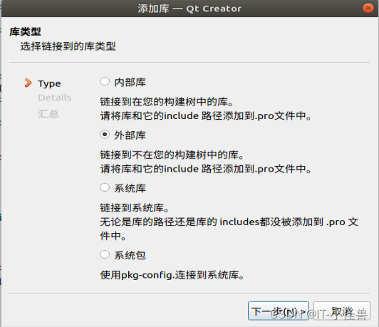

本文仅是在学习QT C++时没有找到适用于doc，docx，pdf的自带库

在网上查找资源后决定使用QtPdium。QtPdfium 是一个 Qt 模块，它使用 google 的 pdfium 项目呈现 PDF 文件。它将 PDF 页面呈现为 QImage。

由于本人项目是运行在Linux（Ubuntu）系统上，QT Creator版本为5.12.7 不包含该库，需要在项目中安装该库文件。

### 安装

当找不到在什么地方进行 git 时，可以在QtCreator中项目编辑列表，单击鼠标右键，在此处打开终端（有时会提示权限不够，可以先切换用户 su ）

```
git clone --recursive https://github.com/1460884940/qtpdfium
cd qtpdfium
qmake
make
make install (might need sudo)
```

### 用法

API 仅包含两个类：`QPdfium`和`QPdfiumPage`.

在引用之前需要引用外部库




库文件添加完成后，要加载 PDF 文件，只需执行以下操作：

```
#include <QtPdfium/QPdfium>

QPdfium pdf("mypdf.pdf");
qDebug() << pdf.isValid(); //should return true
```

您可以获得页数`QPdfium::pageCount()`

您可以按索引访问页面：

```
#include <QtPdfium/QPdfium>

QPdfium pdf("mypdf.pdf");
QPdfiumPage page =  pdf.page(0);
qDebug() << page.width(); // should show something!
```

要生成图像：

```
#include <QtPdfium/QPdfium>

QPdfium pdf("mypdf.pdf");
QPdfiumPage page =  pdf.page(0);
QImage image = page.image(3); //renders it 3 times bigger
```

并提取文本：

```
#include <QtPdfium/QPdfium>

QPdfium pdf("mypdf.pdf");
QPdfiumPage page =  pdf.page(0);
QString pageText = page.text();
```

注意：在 iOS 上，您需要手动初始化 QtPdfium，因为它是静态链接的。只需像这样创建一个全局对象：

```
#ifdef Q_OS_IOS
    //Since it's static library on IOS we need to initialize it by hand
    PdfiumGlobal global;
#endif
```

项目配置


先将文件写出至项目部署运行文件夹，将文件用`QPdfium pdf("mypdf.pdf");`读取并转换成QImage ，然后将图片转换成base64编码格式的png图片，字符串拼接成html格式显示。


